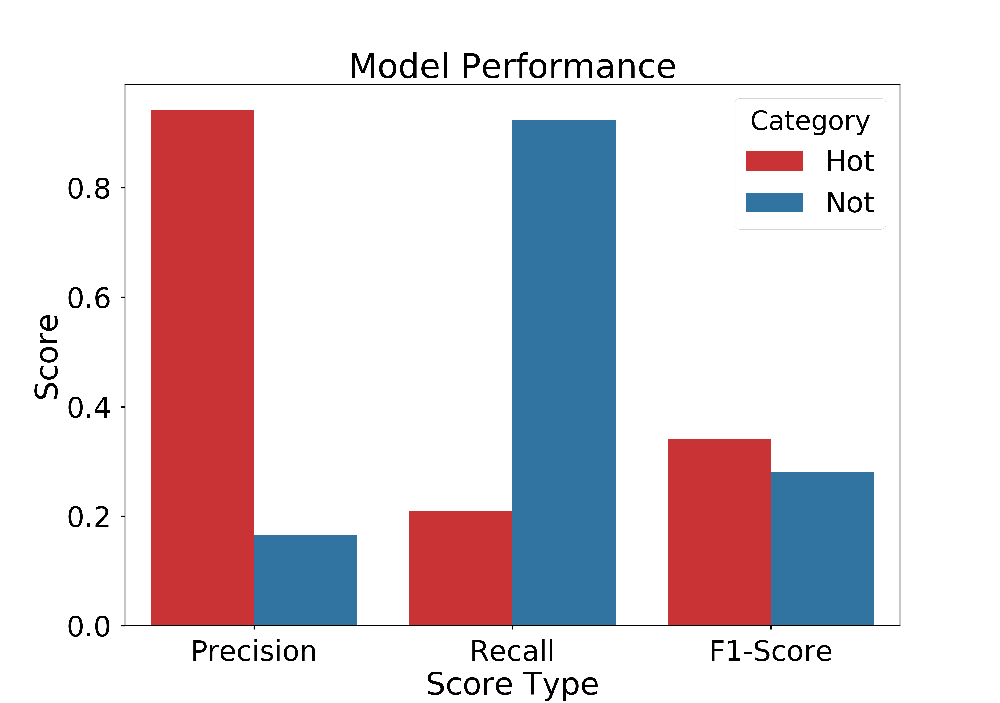

# Intoxicated Machine Learning

*Using machine learning to classify characteristics of New Belgium beer using chemical metrics and beer-tasters' sensory comments*

**Please note that I am unable to share source code for this project because resulting data pipeline and prediction models are the property of New Belgium Brewery**

## Table Of Contents

* [Motivation](#motivation)
* [The Data](#the-data)
* [Analysis](#analysis)
* [Conclusion](#conclusion)
* [Acknowledgments](#acknowledgments)

## Motivation

Can we use chemical measurements of New Belgium beer to predict the commentary of trained beer tasters' and vice versa? Chemical metrics of alcohol (abv), calories, gravity (Ea), pH and other standard measurements are used to predict whether the batch of beer will be rated TTB (True to Brand) by trained New Belgium beer tasters. A web application is developed for use by New Belgium's team of chemists and biologist monitoring chemical and sensory characteristics of each batch of beer. This tool gives these beer scientists the ability to predict how likely a batch of beer will be given the stamp of approval (i.e., TTB) needed in order to bottle and ship each batch.

Further analysis uses processed sensory comments (i.e., natural language) from New Belgium beer tasters and a multi-layer perceptron neural network classifier, to predict the chemical characteristics of New Belgium beer batches are predicted.

## The Data

New Belgium beer-batch data consists of two main datasets, linked on unique brew batch numbers. 

1. Chemical Measurements (batch level): e.g., pH, abv, acetic acid
2. Brand - e.g., Fat Tire, Voodoo Ranger ipa
3. Sensory Data (taster level): True To Brand (TTB) subjective designations and comments on beer *modalities*: aroma, mouth-feel/body, flavor, aroma and overall/fresh

Brew batch numbers are stored in different formats across the ~10 years of collected data. Thus, these will need to be processed into a uniform format. Batch numbers should also be combined with brewery location (i.e., Ft. Collins, co or Asheville, nc) to create a unique id due to possible overlap in batch numbers between the two locations. Sensory comment data will be vectorized for analysis (i.e., for natural language processing). A special exception for the word 'not' may be required due to the prevalence of the word 'not' in modality comments. 

## Analysis 

A **Multi-Layer Perceptron (MLP) Classifier** prediction model from sci-kit learn is applied to this problem. A neural network (in which I taste a hint of vanilla) with 6 Hidden Layers. Model hyper-parameters were selected based on a grid search prioritizing F1-Score (i.e., harmonic mean of precision and recall) for TTB classification. 
<!-- 2. **Random Forest Classifier:** With 600 estimators. -->

The following is a model performance graphic. The neural network’s performance on TTB beer is colored in orange and not-TTB beer in blue. This model may be useful to New Belgium for it identifies beers that are not-TTB in more than 9 out of 10 cases. Model accuracy suffers here because the neural network is essentially over-reactive, guessing not-TTB too often. Notice in precision that only about 1 in 5 New Belgium batches labeled not-TTB are in fact not-TTB. however, when the neural network predicts TTB, it is correct in over 9 of 10 cases.

## Conclusion

This is a proof of concept that chemical measurements of New Belgium brew may be used to predict subjective beer taster commentary.

## Acknowledgments

Thank you Matthew Smith, Senior Business Systems Analyst @ New Belgium for data and guidance. Thanks to Jan Van Zechbroeck, [former Galvanize-er](https://github.com/janvanzeghbroeck/Seeing-Taste) and New Belgium consultant for coding help and these attractive section division lines.

